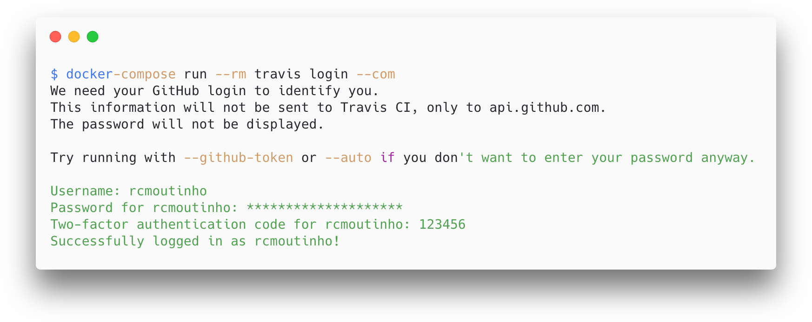

# Travis CLI using Docker

 [](https://microbadger.com/images/rcmoutinho/travis-cli) [](https://microbadger.com/images/rcmoutinho/travis-cli)

This project helps developers that don't want to install the Travis CLI locally but want to have all the benefits of using commands to automate processes instead of manual UI tasks.

Not very familiar with docker? Go to the [docker section](#docker-help) to get the basics to use this project.

## Table of Contents

* [Usage](#usage)
  * [Docker](#docker-for-linux-/-unix-systems)
  * [Docker-Compose](#docker-compose-local-configuration)
* [Secure your Passwords and Tokens](#secure-your-passwords-and-tokens)
* [Build from the scratch](#build-from-the-scratch)
* [Using docker-compose on development mode](#using-docker-compose-on-development-mode)
* [Docker (help!)](#docker-help)
* [References](#references)

## Usage

Check out [Travis CLI](https://github.com/travis-ci/travis.rb) documentation to understand what each command does.

The `/app` volume to your root project folder is useful to get CLI help to adjust and/or create for you the `.travis.yml` file inside of your project.

The `.travis` folder is very important to the process. It will store your _Travis Secret Key_ to maintain you session during the usage and also keep some other configurations to ease your usage. If you had installed manually, this folder would be located on your user home directory (`~/.travis`). **_>> NEVER <<_** commit the `.travis` folder. It has sensitive information that would expose your API secret key, giving open access to your account.

### Docker (for linux / unix systems)

```
docker run --rm -v $(pwd):/app -v $(pwd)/.travis:/root/.travis rcmoutinho/travis-cli <command>
```

_**TIP:** On Windows environments, the command `$(pwd)` used to get the current folder path maybe a little bit different. But this is the only difference. All the rest is the same in any OS._

### Docker-Compose (local configuration)

```
docker-compose run --rm rcmoutinho-travis <command>
```

_**TIP:** Same here. On Windows environments, the command `$(pwd)` inside of the `docker-compose.yml` may be different._

## Secure your Passwords and Tokens

This example will use the Travis CLI to protect a GitHub token inside of your `.travis.yml` file.

---

_**NOTE:** You will notice that every step has a `--com` parameter. This will force the usage of `travis-ci.com` instead of `travis-ci.org`. You can check more about this topic [here](https://devops.stackexchange.com/a/4305)._

---

Let's go a step-by-step process to configure your GitHub configuration with Travis CI.

1.  Make sure you are on the root of the project. This is important to get some Git configuration during the process.

2.  [Login](https://github.com/travis-ci/travis.rb#login) using the travis CLI using your GitHub credentials.

    ```
    travis login --com
    ```

    The following is showing the login using the `docker-compose` command. Note that if you have _two-factor authentication_, it will ask the code after typing the password.
    

3.  Enable the GitHub project on Travis CI.

    ```
    travis enable --com
    ```

    _**NOTE:** You can execute `init` command before if don't have the project configuration defined yet (`.travis.yml`)._

4.  Encrypt the GitHub token.

    ```
    travis encrypt GITHUB_TOKEN="myTokenWithLotsOfNumbersAndLetters123456" --repo username/project-name --com --add
    ```

    - The `--repo` parameter is optional. The CLI will try to suggest considering the git remote configuration.

    ```
    Detected repository as username/project-name, is this correct? |yes|
    ```

    - More about [Travis CI encryption process](https://docs.travis-ci.com/user/encryption-keys/).

    - More about [GitHub Tokens](https://github.com/settings/tokens).

5.  Check your `.travis.yml` to see your new encrypted value.

    ```yml
    # ...
    env:
      global:
        secure: <ENCRYPTED_TOKEN>
    # ...
    ```

That's it! Now your GitHub project is configured with Travis CI, and you can use your token with confidence knowing that everything is secure.

```yml
# ...
api_key: "$GITHUB_TOKEN"
# ...
```

The good news is that the process remains the same as any other token or password you need to protect on Travis CI automation.

## Build from the scratch

To test out your _Docker_ configuration, try to get _travis-cli_ usage help, that will build your local image. On the first execution, the image will automatically build.

```
docker-compose run --rm travis
```

```
Building travis
Step 1/8 : FROM ruby:alpine
 ---> 47c30d96ab20
Step 2/8 : RUN apk --update add build-base git   && gem install travis   && apk del build-base   && rm -rf /var/cache/apk/*   && rm -rf /tmp/*   && mkdir app
 ---> Running in ccac9517fe54
fetch http://dl-cdn.alpinelinux.org/alpine/v3.10/main/x86_64/APKINDEX.tar.gz
fetch http://dl-cdn.alpinelinux.org/alpine/v3.10/community/x86_64/APKINDEX.tar.gz
(1/21) Upgrading musl (1.1.22-r2 -> 1.1.22-r3)
(2/21) Installing binutils (2.32-r0)
(3/21) Installing libmagic (5.37-r0)

# ... long output about the installation process

(14/15) Purging mpc1 (1.1.0-r0)
(15/15) Purging mpfr3 (3.1.5-r1)
Executing busybox-1.30.1-r2.trigger
OK: 41 MiB in 42 packages
Removing intermediate container ccac9517fe54
 ---> 4e3f18910ee3
Step 3/8 : WORKDIR app
 ---> Running in ea071375a006
Removing intermediate container ea071375a006
 ---> 0c0e3107d9d5
Step 4/8 : VOLUME ["/app"]
 ---> Running in cca2e189a712
Removing intermediate container cca2e189a712
 ---> 6f8459f63eb0
Step 5/8 : LABEL maintainer="twitter.com/rcmoutinho"
 ---> Running in bf5cb1e2036c
Removing intermediate container bf5cb1e2036c
 ---> 9df4a2a9a559
Step 6/8 : LABEL description="Travis CLI in a docker container"
 ---> Running in dc1a5d171a04
Removing intermediate container dc1a5d171a04
 ---> 9cb37aa14df8
Step 7/8 : ENTRYPOINT ["travis"]
 ---> Running in c58ecc064749
Removing intermediate container c58ecc064749
 ---> b229ba95d0ab
Step 8/8 : CMD ["--help"]
 ---> Running in d80e7bf0545a
Removing intermediate container d80e7bf0545a
 ---> bea6a8740685
Successfully built bea6a8740685
Successfully tagged travis-cli_travis:latest
WARNING: Image for service travis was built because it did not already exist. To rebuild this image you must use `docker-compose build` or `docker-compose up --build`.
Usage: travis COMMAND ...

Available commands:

	accounts       displays accounts and their subscription status
	branches       displays the most recent build for each branch

# ... long command list
```

Or the following command that will run the `version` command. This time the execution would be wayyyyy faster (almost instantaneous) because the docker image already exists.

```
docker-compose run --rm travis version
```

```
1.8.10
```

The `docker-compose` service is configured with the name `travis`. But all the magic happens because the `Dockerfile` is configured with the _entrypoint_ `travis`. So that's why you just need to type the command you need because the configuration already expects it.

## Using docker-compose on development mode

In the case that your project already has a `docker-compose.yml` or something related, you can rename this project configuration to `docker-compose.dev.yml` or `docker-compose.version.yml` to make sure your automated release configuration won't affect your project. But remember that this change will request an extra parameter on your _compose_ commands. Let's use _Travis_ as an example:

```
COMPOSE_FILE=docker-compose.dev.yml docker-compose run --rm travis
```

You will need to specify the `COMPOSE_FILE` environment variable because the only command that accepts a different file as a parameter is the `docker-compose up`. So to run this configuration without worrying too much, you will need this _<s>hack</s>_ workaround.

## Docker (help!)

Some installations can be prevented using Docker if you want. This project don't has a `docker` folder that would handle (organize) all the `Dockerfile` for each scenario, separated by folders. This project has only one `Dockerfile`.

There is also a `docker-compose.yml` on the root folder to avoid typing _docker_ endless commands and configurations every time you need.

All configurations aim the minimum maintenance. So there is no need to create and maintain networks and volumes, only build the required image to run the desired task, once! To make it happen, use the following pattern for configurations.

```
docker-compose run --rm <docker-compose-service> <desired-command>
```

Using the command `run`, docker will take care to build the image using `Dockerfile` from the _service_ before running the container. And by using `--rm`, the container will be removed after completing the task, that would be your _desired command_.

The unique "garbage", would be the docker image created by the service(s), that you can get rid with the following command.

CAUTION: This command will remove all the images, volumes and networks related to this docker-compose configuration. Pay _VERY GOOD_ attention if you merged your `docker-compose` files before executing the following command.

```
docker-compose down --rmi local
```

## References

Check a [fully automated GitHub project](https://github.com/rcmoutinho/automated-release) using this configuration process to automate software releases. That, by the way, is the project that was the inspiration to create the current one.

In addition to all the google researches, I would give credit to two projects [1](https://github.com/lirantal/docker-travis-cli) [2](https://github.com/andredumas/docker-travis-ci-cli) that I found useful on this journey. Both have the same objective of using Travis CLI with Docker.
